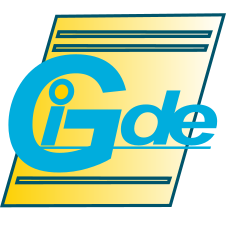

**Gide** is a flexible IDE (integrated development environment) framework in pure Go, using the [GoGi](https://github.com/goki/gi) GUI (for which it serves as a continuous testing platform :) and the [GoPi](https://github.com/goki/pi) interactive parser for syntax highlighting and more advanced IDE code processing.

See the [Wiki](https://github.com/goki/gide/wiki) for more docs,   [Install](https://github.com/goki/gide/wiki/Install) instructions (`go install github.com/goki/gide/cmd/gide@latest` should work if GoGi system libraries are in place), and [Google Groups goki-gi](https://groups.google.com/forum/#!forum/goki-gi) emailing list.

There are many existing, excellent choices for text editors and IDEs, but *Gide* is possibly the best pure *Go* option available.  The Go language represents a special combination of simplicity, elegance, and power, and is a joy to program in, and is currently the main language fully-supported by Gide.  Our ambition is to capture some of those Go attributes in an IDE.

Some of the main features of *Gide* include:

* Designed to function as both a general-purpose text editor *and* an IDE.  It comes configured with command support for LaTeX, Markdown, and Makefiles, in addition to Go, and the command system is fully extensible to support any command-line tools.

* Provides a tree-based file browser on the left, with builtin support for version control (git, svn, etc) and standard file management functionality through drag-and-drop, etc.  You can look at git logs, diffs, etc through this interface.

* Command actions show output on a tabbed output display on the right, along with other special interfaces such as Find / Replace, Symbols, Debugger, etc.  Thus, the overall design is extensible and new interfaces can be easily added to supply new functionality.  You don't spend any time fiddling around with lots of different panels all over the place, and you always know where to look to find something.  Maybe the result is less fancy and "bespoke" for a given use-case (e.g., Debugging), but our "giding" principle is to use a simple framework that does most things well, much like the Go language itself.

* Strongly keyboard focused, inspired by Emacs -- existing Emacs users should be immediately productive.  However, other common keyboard bindings are also supported, and key bindings are entirely customizable.  If you're considering actually using it, we strongly recommend reading the [Wiki](https://github.com/goki/gide/wiki) tips to get the most out of it, and understand the key design principles (e.g., why there are no tabs for open files!).

# Install

* Wiki instructions: [Install](https://github.com/goki/gide/wiki/Install) -- for building directly from source.

* See Releases on this github page for pre-built OS-specific app packages that install the compiled binaries.

* See `install` directory for OS-specific Makefiles to install apps and build packages.

# Current Status

As of April 2020, it is feature complete as a Go IDE, including type-comprehension-based completion, and an integrated GUI debugger, running on top of [delve](https://github.com/go-delve/delve).  It is in daily use by the primary developers, and very stable at this point, with the initial 1.0 release now available.

In addition to Issues shown on github, some important features to be added longer-term include:

* More coding automation, refactoring, etc.  We don't want to go too crazy here, preferring the more general-purpose and simple approach, but probably some more could be done.

* Full support for Python, including extending the [GoPi](https://github.com/goki/pi) interactive parser to handle Python, so it will have been worth writing instead of just using the native Go parser.

# Screenshots

