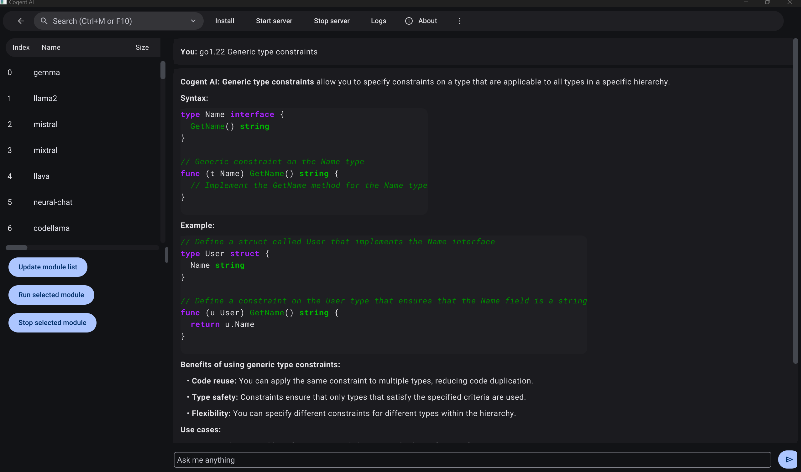

# Cogent AI
Cogent AI is a local ai chat client,it supports local file system and network access features.  



 
how to build ?

```go
1. git clone https://github.com/cogentcore/cogent.git

2. install golang from https://go.dev/dl/

3. install gcc

4. go install cogentcore.org/cogent/ai@latest

```